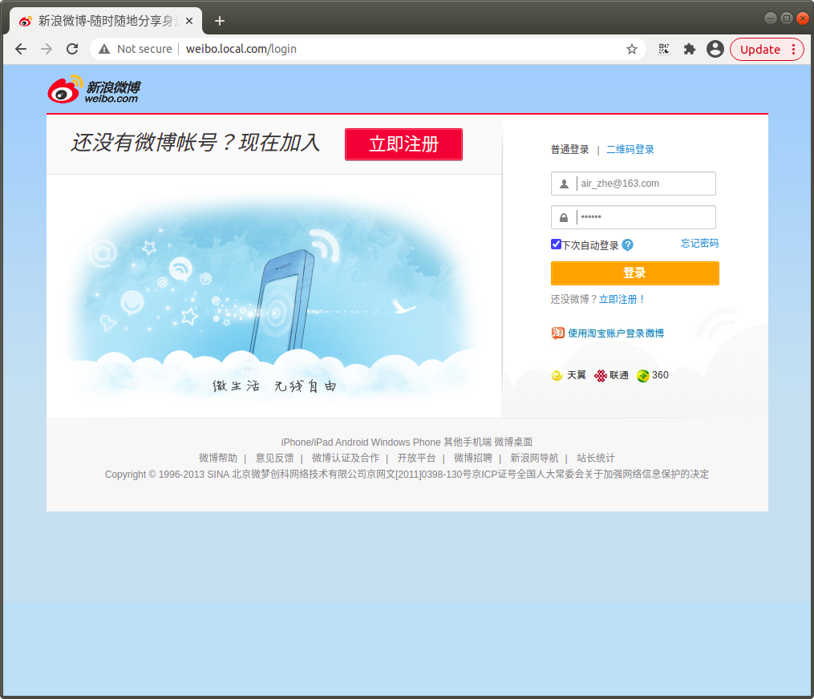
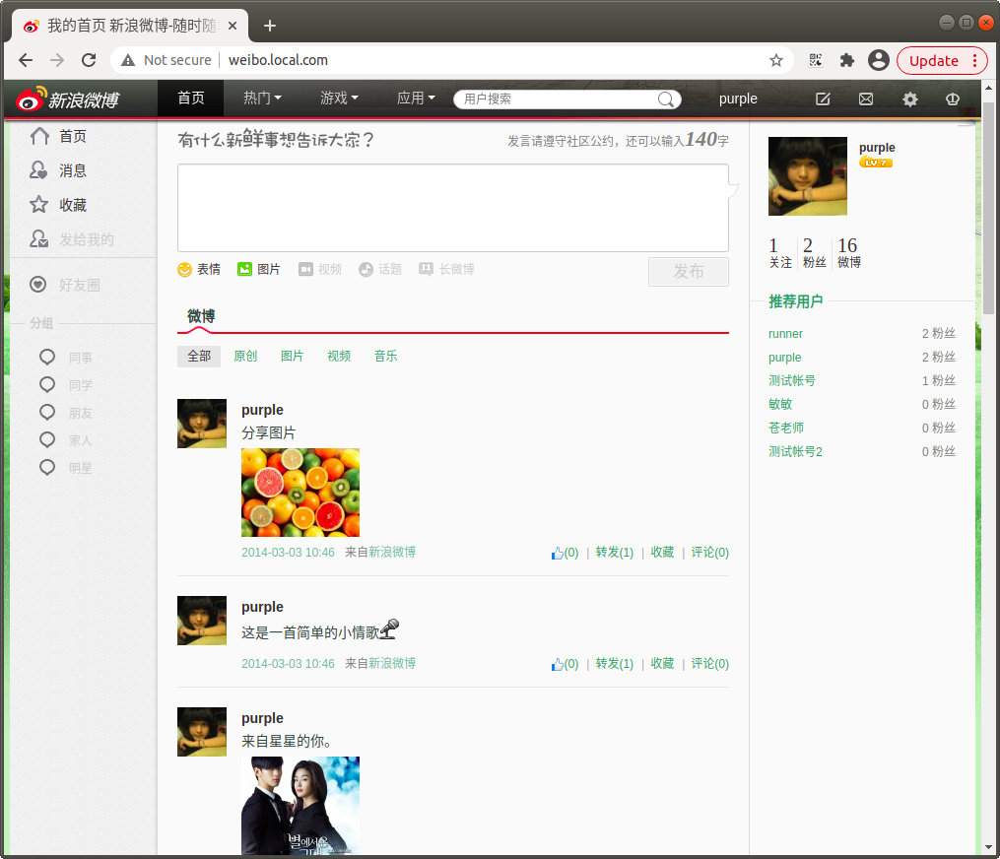
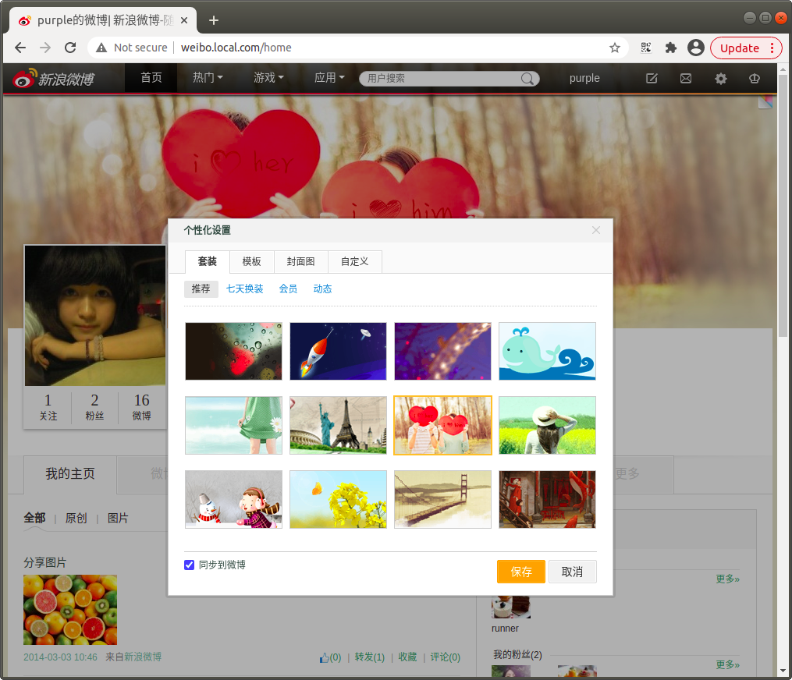
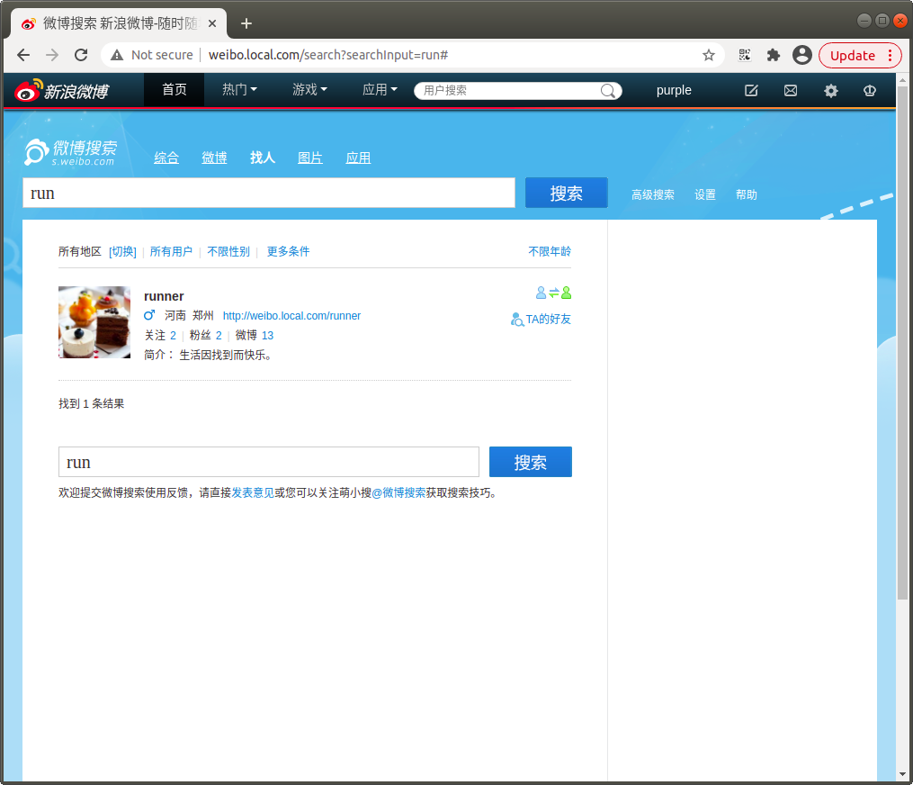

# 基于CI框架的仿新浪微博客项目

基于LAMP平台开发 ，使用AJAX来确保访问者在浏览网站时的流畅性；使用用动画特效(JQUERY),让访问者有更好的体验；

实现了用户 
注册、
登录、
自定义皮肤，
自定义个性域名、
关注、取消关注、
评论、转发、收藏、点赞、@，私信、
以及异步轮询的方式实现消息的及时推送。

### 说明
本项目是多年前培训结束的结业项目，后期没有维护，代码比较早，自测在 php7 下可运行，如果有问题可以再提issue

### 项目截图：

